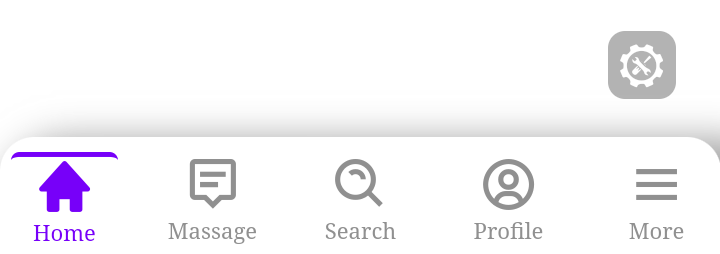

# tStNav-Bottom
* Sebuah navbar bottom sederhana untuk tampilan android 
* ya udah gitu doang

## 📝
* HTML5
* CSS
* JavaScript
* * jQuery
## 💙
* Yeyy dahh fix active nya

## 🌐
* Demo : Coba di hp sendiri dah di upload github malah aneh 🙂
* Nih image

